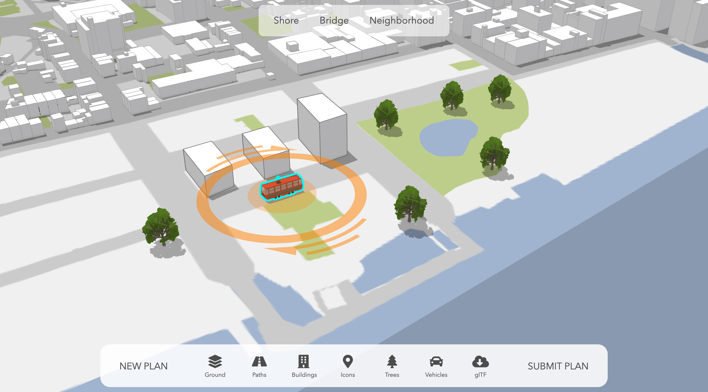

# Dumbo Participatory Planning

This is a non-commercial, demo application made at the Esri R&D Center Zurich to show Participatory Planning
in the Dumbo quarter of Brooklyn NY.





## Instructions

1. Fork and then clone the repo.
2. Run and try the samples.

```
npm install
npm run start # serves application at http://localhost:8080
```

## Resources
The following external libraries, APIs, open datasets and specifications were used to make this application:

## Disclaimer

This demo application is for illustrative purposes only and it is not maintained. There is no support available for deployment or development of the application.

## Contributing

Esri welcomes contributions from anyone and everyone. Please see our [guidelines for contributing](https://github.com/esri/contributing).

## Licensing
Copyright 2017 Esri

Licensed under the Apache License, Version 2.0 (the "License");
you may not use this file except in compliance with the License.
You may obtain a copy of the License at

   http://www.apache.org/licenses/LICENSE-2.0

Unless required by applicable law or agreed to in writing, software
distributed under the License is distributed on an "AS IS" BASIS,
WITHOUT WARRANTIES OR CONDITIONS OF ANY KIND, either express or implied.
See the License for the specific language governing permissions and
limitations under the License.

A copy of the license is available in the repository's [license.txt](./license.txt ) file.
